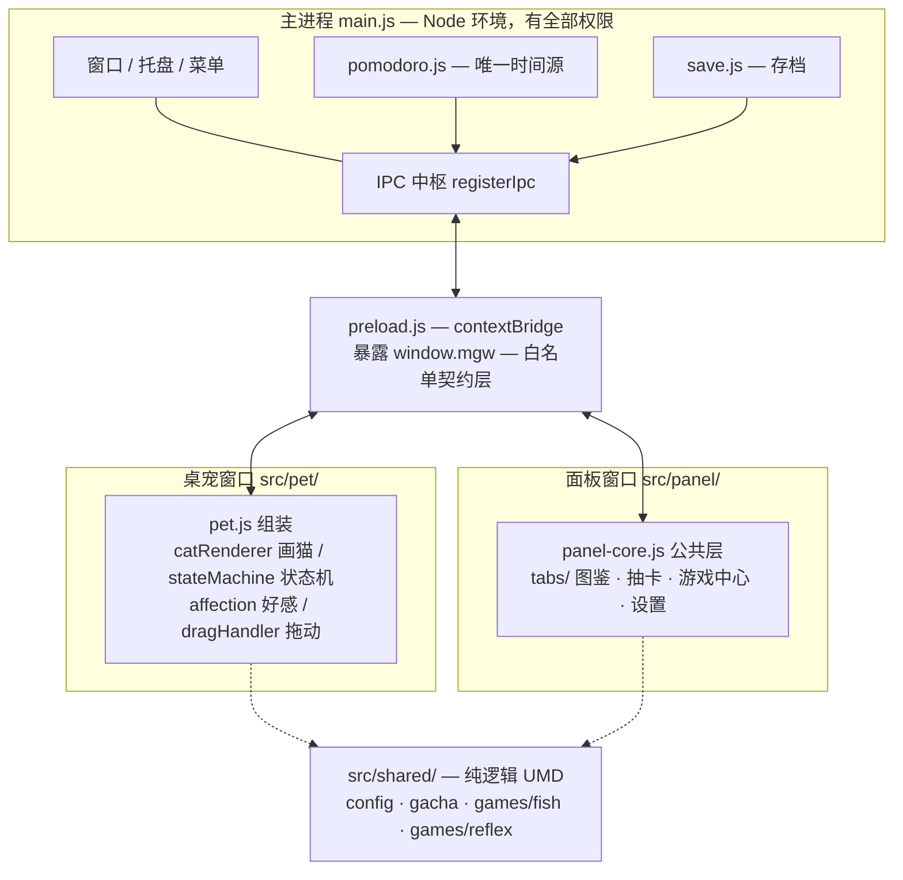

# 架构文档

一页纸看懂喵工位怎么跑起来。**不追求完备**——只讲「你改动某处时必须知道的东西」。

---

## 一、三层结构



| 层 | 位置 | 能做什么 | 不能做什么 |
|---|---|---|---|
| 主进程 | `main.js`、`src/main/` | 窗口、托盘、文件、系统通知、计时 | 不画 UI |
| 契约层 | `preload.js` | 白名单 IPC 桥（`contextIsolation: true`） | 不含业务逻辑 |
| 渲染层 | `src/pet/`、`src/panel/` | DOM / Canvas / IPC 调用 | **不能 `require`**，不能读写文件 |
| 纯逻辑层 | `src/shared/` | 数值、概率、判定、状态换算 | **不碰 DOM、不碰 IPC** |

`src/shared/` 全是 UMD 模块，同一个文件既能被主进程 `require`、被页面 `<script>` 挂成全局、也能被 node 自测直接 require。**这是整套自测能力的地基**：数值改动不需要开 Electron 就能验证。

---

## 二、窗口

| | 桌宠窗 | 面板窗 |
|---|---|---|
| 文件 | `src/pet/index.html` | `src/panel/index.html` |
| 尺寸 | `petMetrics(scale)` 算出来（默认 242×280） | 900×640（`config.window.panel`） |
| 关键参数 | `transparent` + `frame:false` + `resizable:false` + `skipTaskbar` + `alwaysOnTop('screen-saver')` | 普通窗，`backgroundColor:#14100c` |
| 生命周期 | 启动即建；`pet:menu` 弹右键菜单 | 按需创建；已存在则 `show()` + 聚焦 |
| 渲染进程崩溃 | 自动 reload（最多 3 次） | — |

**CSP**（`src/pet/index.html`）：`default-src 'self'; style-src 'self' 'unsafe-inline'; script-src 'self'; img-src 'self' data:`（`data:` 供图片桌宠的 dataURL）。
→ 这是**离线铁律的来源**：不能引 CDN 字体/脚本。拉丁数字用系统等宽（Cascadia Mono / Consolas）兜底。

---

## 三、IPC 通道

`preload.js` 里一次性定死，**只增不改**。三个方向：

**渲染层 → 主进程（`invoke`，有返回值）**

| 通道 | 用途 |
|---|---|
| `assets:read` | 读 `assets/` 下的 JSON（路径被限制在 `assets/` 内，防穿越） |
| `save:load` | 取存档快照 |
| `save:patch` | 深合并写入，返回**写后快照**（渲染层以此为权威） |
| `pomodoro:get` | 主动拉番茄状态（广播丢失时的兜底） |
| `pets:list` / `pets:get` | 图片桌宠：列表（带缩略图）/ 取图（dataURL，`thumb` 选项给 128px 缩略图） |
| `pets:create` / `pets:set-slot` / `pets:clear-slot` / `pets:rename` / `pets:remove` | 图片桌宠：新建 / 换槽位图 / 清槽位 / 改名 / 删除（前两个弹系统文件框，统一返回 `{ok,...}`） |
| `pets:select` | 切换当前桌宠（内置猫或图片），写存档并广播 `pet:changed` |

**渲染层 → 主进程（`send`，无返回值）**

| 通道 | 用途 |
|---|---|
| `pet:move` | 传**窗口内偏移**（非绝对坐标），主进程用 `getCursorScreenPoint()` 换算 |
| `pet:resize` | 缩放请求 `{w,h}`，主进程按中心锚定 + 工作区夹取 |
| `pet:menu` / `tray:icon` | 弹菜单 / 换托盘图标 |
| `panel:open` | 打开面板（可指定 tab） |
| `pet:react` | 桌宠围观联动（面板 → 主进程转发 → pet 窗） |
| `settings:set` | 改设置 |
| `pomodoro:start` / `pause` / `skip` | 番茄钟控制 |
| `pomodoro:distracted` | 桌宠报告本番茄摸鱼超限 → 结算打折（仅 work 阶段） |

**主进程 → 渲染层（广播）**

| 通道 | 用途 |
|---|---|
| `pomodoro:state` | 每 250ms 的番茄状态（phase / remaining / duration / progress） |
| `pomodoro:done` | 阶段结束（带 `reward` 与 `distracted` 标记） |
| `settings:changed` | 设置变更 |
| `panel:navigate` | 切 tab |
| `pet:react` | 围观反应（`{kind, score, best, game}`） |
| `pet:changed` | 当前桌宠变更（切换 / 删除回退 / 当前宠物的槽位图更新） |

**广播注意**：主进程 `broadcastAll()` / `pomodoro.send()` 都**逐窗口 try/catch** —— 某个窗口的 `webContents` 异常不能连累后面的窗口。桌宠靠在最后收到 `pomodoro:state` 来收沙漏，漏一条就卡住。

**图片桌宠的存储与数据流**：上传图片**不进仓库 `assets/`**（`assets:read` 被锁死在仓库内），而是归一化（居中裁方 → 限长边 → PNG 保 alpha）后存 `userData/pets/<petId>/`（`pet.json` + `<槽位>.png`，文件系统即真相）。数据流：面板「桌宠」页 → `pets:*` → 主进程 `src/main/pets.js`（fs + nativeImage）→ 桌宠窗 `pets:get` 拿 dataURL → `src/pet/imageRenderer.js` 画进同一个「24 格显示盒」（与 `catRenderer.js` 同接口，`pet.js` 按 `currentPet.type` 分流）。

---

## 四、模块与全局名

浏览器端（无构建步骤）靠全局对象串联，命名有约定：

| 文件 | 全局名 | 说明 |
|---|---|---|
| `shared/config.js` | `MGW_CONFIG` | 全局数值表 |
| `shared/gacha.js` | `MGW_Gacha` | 抽卡（`compute()` 只算不写，返回可交给 `patchSave` 的 patch） |
| `shared/games/fish.js` | `MGW_Fish` | 鱼干突袭逻辑 |
| `shared/games/reflex.js` | `MGW_Reflex` | 反应力逻辑 |
| `shared/audio.js` | `MGW_Audio` | 音效（**零调用**） |
| `shared/petAssets.js` | `MGW_PetAssets` | 图片桌宠纯逻辑（裁方形 / 校验 / 来源解析） |
| `pet/catRenderer.js` | `CatRenderer` | 画像素猫 + `isOpaqueAt()`（`stop()` 可停 rAF） |
| `pet/imageRenderer.js` | `ImageRenderer` | 画图片桌宠（与 CatRenderer 同接口） |
| `pet/stateMachine.js` | `StateMachine` | 状态机（清单在 `config.petStates`） |
| `pet/affection.js` | `Affection` | 好感与经济 |
| `pet/dragHandler.js` | `MGW_Drag` | 拖动（阈值判定，区分点击/拖拽） |
| `pet/pet.js` | `MGW_DEBUG` | 调试入口（菜单里切猫/切状态） |
| `panel/panel-core.js` | `MGW_Panel` | 面板公共层 |
| `panel/tabs/*.js` | `MGW_Tab*` | tab 模块：`render(root)` + 可选 `onSave()` / `onHide()` |
| `panel/tabs/games/*.js` | `MGW_Game*` | 子游戏 UI |

**加新游戏的约定**（照抄即可）：

```
逻辑  src/shared/games/<name>.js     →  MGW_<Name>
UI    src/panel/tabs/games/<name>.js →  MGW_Game<Name>
配置  config.<name>
自测  tools/<name>-selftest.js       →  记得加进 package.json 的 test 脚本
```

UI 模块暴露 `render(root)`，另有两个可选钩子：`onSave()`（存档变了，只局部刷新，**不要重建 DOM**）、`onHide()`（切走 tab 时收摊，中止本局）。游戏中心（`tabs/game.js`）会把这两个钩子透传给当前子游戏。

---

## 五、存档

位置：`app.getPath('userData')/miaogongwei-save.json`，即 `%APPDATA%\喵工位\`。

```
写盘策略：patchSave() → 深合并 → 标脏 → 2s 防抖落盘 → 写前 copy 一份 .backup.json
读盘策略：JSON.parse 失败 → 回退默认档（不让坏档卡死启动）
跨天处理：读档时若 pomodoro.lastDate ≠ 今天 → today 清零
退出兜底：app.on('before-quit') → flushNow()
```

| 字段 | 含义 |
|---|---|
| `coins` / `tickets` | 金币 / 抽卡券 |
| `cards` | `{ cardId: 拥有数 }` |
| `pity` | 抽卡保底计数（50 抽必出 SSR） |
| `affection` | 好感度（等级阈值见 `config.affectionLevels`） |
| `currentCat` | 当前出场的猫 |
| `pomodoro` | `{today, total, lastDate}` |
| `stats` | `{draws, bestGameScore, bestReflexMs, reflexBreaks}` |
| `settings` | `{workMin, breakMin, volume, alwaysOnTop, petScale}` |

⚠️ **`patchSave` 是覆盖语义**：它做的是 `mergeDeep`，不是"加"。任何累加都要自己读现值：
```js
save.patchSave({ coins: (st.coins || 0) + delta });   // ✅
save.patchSave({ coins: delta });                      // ❌ 直接覆盖
```

⚠️ `settings.petScale`、`stats.bestReflexMs` / `reflexBreaks` **不在 `DEFAULT_SAVE` 里**，是运行时由功能写入、靠 `mergeDeep` 兜住的新键。加新键时记得补进 `DEFAULT_SAVE`（见[工程债](PLAN.md#已知工程债)）。

**乐观更新**（`panel-core.js` 的 `applyPatch`）：先本地 `mergeDeep`（防连点读到旧值），再用主进程返回的快照覆盖。抽屉式的写盘会慢一拍，不先本地合并的话连点抽卡会丢次数。

---

## 六、番茄钟：主进程是唯一时间源

**为什么放主进程**：窗口最小化/被遮挡时渲染层的定时器会被节流甚至停摆，只有主进程的时间可靠。

```
start(phase) → endAt = Date.now() + durationMs
每 250ms tick → remainMs = max(0, endAt - Date.now())   ← 时间戳差值，扛休眠/节流
             → broadcast('pomodoro:state')
             → remainMs <= 0 → complete()
complete(work)  → 结算 (+30 金币 / +1 券 / +10 好感；摸鱼超限则打折) → 通知 → 广播 done → 自动 start('break')
complete(break) → 只通知 → phase = 'idle'
```

**状态同步三道保险**（任一条断了沙漏就卡住，所以冗余）：

1. 主进程每 tick 广播（逐窗口 try/catch）
2. 桌宠窗 `did-finish-load` 后主动推一次（渲染层可能错过启动期广播）
3. 渲染层启动时、以及窗口重新聚焦/可见时 `pomodoroGet()` 主动拉一次

`remaining` 是整数秒（给文字），`progress` 是 0~1 浮点（给绘制）——**别用整数秒自己做除法算进度**，会丢精度导致沙漏几乎不动。

**专注期间：气泡静默 + 互动惩罚**（`pet/pet.js`）：`sayText()` 是唯一气泡出口，`pomoWorking`（`work && running`）时直接 `return`（不弹、不排队）；进入专注会 `hideBubble()` 收掉挂着的那条；只放行暂停 / 继续与 `pomodoro:done` 结算（`{force:true}`）。⚠️ 暂停不算专注，否则「⏸ 番茄已暂停」自己就被拦掉。

摸头 / 喂食在专注中走 `focusInteract()`：**不给收益**（摸头不加好感、喂食不扣币、不切 happy/eat），只弹 `focusNag`；同一番茄内超过 `config.pomodoro.interact.nagLimit` 次后**每次**「……」+ annoyed + 扣 1 好感，并在首次超限时报告主进程 —— 本番茄结算按 `config.pomodoro.distractedPenalty` 打折（金币 / 好感 ×比例、无券；`pomodoro:distracted` 仅 work 阶段收）。计数与标记在**换番茄**时清零（暂停→继续不算换番茄）。

---

## 七、尺寸：`petMetrics()` 是唯一真理源

主进程建窗、渲染层画布、沙漏尺寸、气泡与按钮栏的居中基准，**全部读同一个函数**：

```js
petMetrics(scale) → { scale, padL, padR, catW, offsetX, offsetY, width, height, hourglass }
```

- `scale` = 每格像素（4~16，默认 8）
- 窗口宽 = `24×s + padL + padR`，其中 **padL 4.5 格**（站沙漏）/ **padR 1.75 格**
- ⚠️ **左右留白不等宽，所以气泡和按钮栏必须按「猫的中线」居中，不能按窗口居中** —— 按窗口居中会整体右偏。CSS 里挂 `--padl` / `--padr` 实现。

### 漂移问题的根因（踩了三次才定位）

高 DPI（实测 dpr=1.5）下窗口矩形要取整，Chromium 用 `floor(左)/ceil(右)` 换算：

| 写法 | 结果 |
|---|---|
| `setPosition()` 只挪位置 | 每次移动高度 **+1px**，累积 → 贴边元素越拖越远 |
| `setBounds()` 连宽高一起写 | 尺寸恒定 ✅ |
| 拿 `getBounds()` 回报值当下一帧请求值 | 逐帧长大（探针实测 12 帧 213×246 → 224×257） |

**两条铁律**：

1. 窗口位移/缩放一律 `setBounds({x, y, width, height})`，**永远不用 `setPosition`**。
2. `petSize` 只记**自己算出来的请求值**（`pet:resize` 传进来的 `{w,h}`、或建窗时 `petMetrics` 的结果），**绝不记 `getBounds()` 的回报值**。

诊断告警留了 `PET_SIZE_TOL = 1` 容差 —— 那个 ±1 是取整噪声（物理尺寸没变，只是回报在抖），不留容差的话每次拖动都会刷屏误报。

回归工具：`tools/win-bounds-drift-probe.js`（必须自己 `app.disableHardwareAcceleration()`，否则沙箱里 GPU 进程崩溃会静默带走整个进程）。

---

## 八、五条硬约束（都是踩坑换来的）

| 约束 | 原因 |
|---|---|
| **透明窗不用 `transition`/`animation`/`transform`/`opacity` 渐变** | 会提升合成层，合成层错位 = 拖动漂移。显隐用 `visibility` 直接切 |
| **窗口尺寸用 `setBounds` 不用 `setPosition`** | 见上一节 |
| **渲染层不 `require`** | `contextIsolation: true`；素材走 `assets:read` |
| **音效零调用** | 产品决策：摸鱼场景不能出声 |
| **console 日志一律英文** | Windows 终端 GBK 中文乱码 |

---

## 九、两条典型数据流

**一次番茄完成**

```
用户点 🍅 / 右键菜单 / 托盘
  → renderer: mgw.pomodoroStart()
  → main: ipcMain 'pomodoro:start' → pomodoro.togglePause()
  → 250ms tick 广播 'pomodoro:state'
  → pet: updateHourglass() 重画沙漏（上半沙 = sqrt(progress)）
  → 到点: complete() → 按摸鱼标记选奖励（摸鱼过则打折）→ save.patchSave(累加金币/券/好感) → Notification
        → 广播 'pomodoro:done'（带 reward + distracted；pet 播 happy + 结算台词，专注中唯一放行的气泡）
        → 自动 start('break')
```

**一次游戏结算**

```
panel 子游戏跑完一局
  → 逻辑层 MGW_Fish.settle() 只算不写，返回 patch
  → panel-core.applyPatch(patch)：先本地 mergeDeep（乐观），再等主进程快照
  → mgw.petReact({kind:'best', score, best, game:'fish'})
  → main 转发 'pet:react' → pet: 按 msg.game 选台词池
        （reflex → reflexBest/Praise/Ok/Roast，否则 gameXxx）
  → pet 播 happy/shock + 气泡台词
```

---

## 十、测试结构

| 类型 | 位置 | 需要 Electron | 盯什么 |
|---|---|---|---|
| 逻辑自测 | `tools/*-selftest.js` | ❌ | 概率、数值、判定、结算 patch |
| UI 冒烟 | `tools/panel-smoke.js`、`pet-smoke.js` | ✅ | 真窗真 DOM、tab 切换、结算卡放得下、拖动尺寸恒定、番茄期气泡静默 |
| 边界探针 | `tools/win-bounds-drift-probe.js` | ✅ | setBounds vs setPosition、取整噪声、反馈回路 |

冒烟脚本的两个通用坑（详见 `~/.workbuddy/skills/electron-ui-smoke`）：

- **面板游戏页的截图不可信** —— 沙箱里合成帧严重滞后（截到的是十几秒前的旧帧）。游戏相关验收**一律用 DOM 断言**。
- **mock 主进程必须复刻生产逻辑** —— 冒烟里的 `pet:resize` mock 曾把 `getBounds()` 回报值当期望值，与真机不一致，测出来的是假象。
